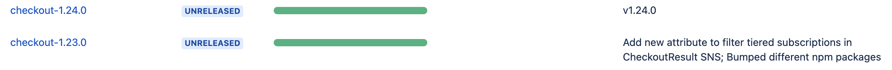

# Jira Release github action

The purpose of this github action is to synchronize Releases in Github with the Releases in Jira (Cloud).

## How it works

When a new Pre-Release is published in Github (essentially, when a new tag is created), the `release` event of type `published` is emitted. It is possible to configure GHA workflow to react on that event.

The `Jira Release` action will fetch details about the Release - the name and the tag. Then, it will grab the last 2 tags, and will get the change log between those, looping through each commit.

From each commit's summary the JIRA issue number will be extracted.

**NOTE**: *The action is built with the assumption that commit messages are written in a certain format: `JIRA-123: Commit summary message` (essentially, it is the format supported by the commitizen project, see <https://www.npmjs.com/package/commitlint-config-jira>).*

Next, the Action will go to Jira (via REST API) and create a new Release named after the repository name concatenated via '-' with the tag name.

**NOTE**: *If tag's name starts with the `v` prefix, then the prefix will be dropped.*

The title of the Github Release will be used as a description of the Release in Jira.

**Example:**



Eventually, the Action will update all the relevant Jira tickets with the "Fix versions" set to the current Jira Release name.

Keep in mind that the version will be appended to the already existing list of versions assigned to the ticket (the `update` operation is used):


## How to use

In the `.github/` directory within the repository create a new workflow file with the content like this:

```yaml
name: Sync Github and Jira release

on:
  release:
    types: [published]

jobs:
  jira_release:
    timeout-minutes: 5
    runs-on: ubuntu-latest
    steps:
      - name: Checkout
        uses: actions/checkout@v2
      - name: Create Jira Release
        id: jira-release
        uses: rodush/github-actions-jira-release@v1
        with:
          project_id: 13327
          project_key: "TRS"
        env:
          JIRA_API_USER: ${{ secrets.ATLASSIAN_CLOUD_USER }}
          JIRA_API_TOKEN: ${{ secrets.ATLASSIAN_CLOUD_APIKEY }}
          ATLASSIAN_CLOUD_DOMAIN: ${{ secrets.ATLASSIAN_CLOUD_DOMAIN }}
          GITHUB_TOKEN: ${{ secrets.GITHUB_TOKEN }}
```

The example above expects a list of certain secrets available in the repository:  

- `ATLASSIAN_CLOUD_USER`
- `ATLASSIAN_CLOUD_APIKEY`
- `ATLASSIAN_CLOUD_DOMAIN`

### Action inputs

The action requires 2 input parameters provided:

- `project_id` , used in the API calls
- `project_key`, used in the regular expression to extract Jira ticket number from the commit summary message

The action requires 4 environment variables:

- `JIRA_API_USER`
- `JIRA_API_TOKEN`
- `ATLASSIAN_CLOUD_DOMAIN`
- `GITHUB_TOKEN`

## Permissions

**NOTE**
The API user used to communicate with Jira needs to have the "Admin" rights for a project where Releases are to be created.
